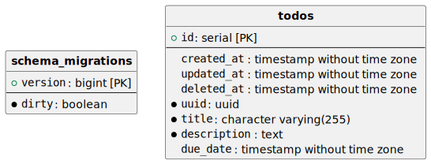

# Data model

## all

Every entity on the database has the attributes `created_at`, `updated_at`, `deleted_at`, that represent
the respectives timestamps of the operation. It will be
in UTC. deleted_at will be filled only for entities that
are using a logic deletion.

## todos

Represent the things we still need todo, with a
`title` and `description`. It is identified by the `uuid`.
